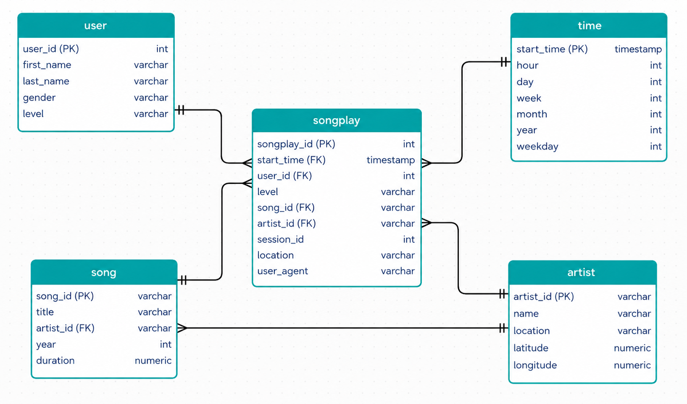
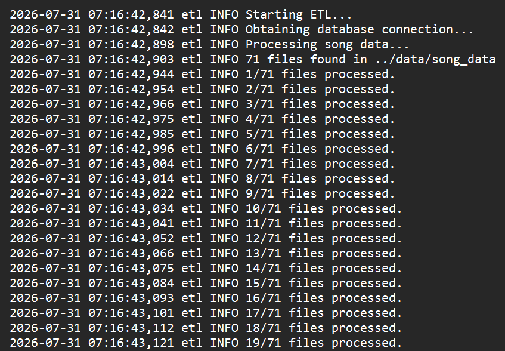

# Streamly ETL Pipeline

## Overview

This project implements an ETL (Extract, Transform, Load) pipeline for Streamly, a fictional music streaming platform.

The pipeline extracts song metadata and user activity logs from JSON files, transforms the data into a relational format, and loads it into a PostgreSQL database using a star schema optimized for analytical queries.

The project demonstrates core data engineering concepts including data modeling, ETL development, transaction management, configuration management, logging, and error handling.

## Tech Stack

- **Language:** Python 3
- **Database:** PostgreSQL
- **Data Processing:** Pandas
- **Database Driver:** psycopg2
- **Configuration Management:** python-dotenv
- **Logging:** Python logging module

## Project Structure

```text
streamly-etl-pipeline/
├── data/                 # Input song and log datasets
├── screenshots/          # Images used in the README, including the ERD
├── src/
│   ├── config.py
│   ├── create_tables.py
│   ├── etl.py
│   ├── logger_config.py
│   └── sql_queries.py
├── tests/                # integration testing of ETL pipeline
├── .env                  # Local environment variables (ignored by Git)
├── .env.example          # Sample environment variables
├── .gitignore
├── README.md
└── requirements.txt
```

### Key Files

| File | Purpose |
|------|---------|
| `etl.py` | Runs the ETL pipeline by extracting, transforming, and loading data into PostgreSQL. |
| `create_tables.py` | Creates the database (if needed) and initializes the database schema. |
| `sql_queries.py` | Stores all SQL statements used by the project. |
| `config.py` | Loads database configuration from environment variables. |
| `logger_config.py` | Configures application logging. |
| `requirements.txt` | Lists all Python dependencies. |
| `.env.example` | Template for required environment variables. |

## Database Schema

The project uses a **star schema** optimized for analytical queries.

### Fact Table

| Table | Description |
|-------|-------------|
| `songplays` | Stores records of song play events. Each row represents a single song playback. |

### Dimension Tables

| Table | Description |
|-------|-------------|
| `users` | Stores user information. |
| `songs` | Stores song metadata. |
| `artists` | Stores artist information. |
| `time` | Stores timestamp attributes derived from song play events. |

## Setup & Installation

### 1. Clone the repository

```bash
git clone <repository-url>
cd streamly-etl-pipeline
```

### 2. Create a virtual environment

```bash
python -m venv .venv
```

Activate it.

**Windows**

```bash
.venv\Scripts\activate
```

**macOS / Linux**

```bash
source .venv/bin/activate
```

### 3. Install dependencies

```bash
pip install -r requirements.txt
```

### 4. Configure environment variables

Create a `.env` file in the `src/` directory using `.env.example` as a template.

### 5. Initialize the database

```bash
python -m src.create_tables
```

### 6. Run the ETL pipeline

```bash
python -m src.etl
```

### 7. Test the ETL pipeline

```bash
python -m pytest
```

## Logging & Error Handling

The project includes structured logging and exception handling to improve reliability and simplify debugging.

### Features

- Application logs are written to `Logs/streamly.log`.
- Environment variables are used to protect database credentials.
- Exceptions are logged with stack traces using Python's `logging` module.
- Failed database transactions are rolled back to maintain data consistency.
- Database connections are safely closed using `finally` blocks.

## Screenshots

### Entity Relationship Diagram



### ETL Execution



## License

This project is licensed under the MIT License.
